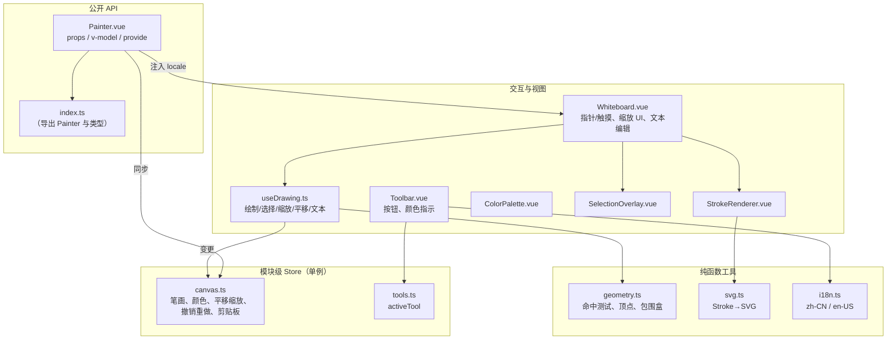

# xiaodao-painter —— 组件架构设计文档

本文档说明 **xiaodao-painter** 的内部结构：模块划分、状态模型、公开 API 与画布之间的数据流、渲染管线、交互引擎，以及撤销/重做设计。建议配合 `src/components/painter/` 下的源码阅读。

## 1. 设计目标

- **自包含。** 单个 Vue 3 组件，除 Vue 外零运行时依赖，无需全局注册，无需 CSS 框架。
- **状态可序列化。** 整份绘图是单个普通对象（`PainterData`），便于保存、加载与同步。
- **可预测的双向绑定。** 父组件拥有数据，组件回显并在变更时通过 `v-model` 上报。
- **轻量且跨端的事件处理。** 手动处理指针与触摸事件，规避 iOS Safari 在祖先元素使用 CSS transform 时 `getScreenCTM` 不可靠的问题。

## 2. 总体架构



架构分为三个概念层：

1. **公开 API** —— `index.ts` 与 `Painter.vue`，用户唯一需要导入的部分。
2. **Store** —— 两个模块级响应式单例（`canvas.ts`、`tools.ts`），持有全部可变状态与变更接口。由于是模块作用域，每次 `useCanvasStore()` 返回的都是同一个对象。
3. **视图 / 引擎** —— 各 Vue 组件与 `useDrawing` 组合式函数，负责把原始指针事件转化为 store 变更，以及纯函数工具（`geometry`、`svg`、`i18n`）。

## 3. 状态管理

状态保存在两个用 `reactive()` 创建的模块级对象中：

| Store | 职责 |
| --- | --- |
| `canvas.ts` | `strokes[]`、`selectedStrokeIds`、前景/背景/文本颜色、色槽、线宽、画布尺寸、平移缩放、撤销/重做栈、剪贴板、文本编辑态、主题、`dataVersion`。 |
| `tools.ts` | `activeTool` 以及 `setTool()`（离开「选择」工具时会清空选择）。 |

`canvas.ts` 暴露一个 `state` 对象，`useCanvasStore()` 直接返回它：

```ts
export function useCanvasStore(): CanvasStore {
  return state
}
```

**隐含限制：** 因为 store 是单例，当前设计假设页面上只存在一个激活实例。`Painter.vue` 在 setup 时调用 `canvasStore.reset()` 与 `toolsStore.reset()` 以保证干净的初始状态。若要在同一页面渲染两个 `<Painter>`，会共享状态 —— 这是支持多实例前需要解决的前提。

### v-model 协议

`Painter.vue` 在父级的 `modelValue` 与内部 store 之间架桥：

- **父 → store：** 对 `modelValue.strokes` 的深度监听调用 `canvasStore.syncFromParent()`，并用 `syncing` 标志防止回环；画布尺寸与背景在变化时同步。
- **store → 父：** 监听 `strokes.length | canvasWidth | canvasHeight | canvasBackgroundColor | dataVersion`，触发 `emit('update:modelValue', …)` 并克隆快照。组件内的 `suppressing` 标志避免回写值再次进入 `syncFromParent`。

这套「store 内 `syncing` + 组件内 `suppressing`」的双重标志，正是双向绑定不会陷入无限监听的关键。

## 4. 坐标系与变换

画布是一个固定 `viewBox`（`0 0 canvasWidth canvasHeight`）的 SVG。平移与缩放通过对包裹层施加一次 CSS 变换实现：

```
transform: translate(panX, panY) scale(zoomLevel)
```

屏幕 → 画布坐标的转换手动计算（不使用 `getScreenCTM`）：

```ts
canvasX = (clientX - wrapperRect.left) / zoomLevel
canvasY = (clientY - wrapperRect.top) / zoomLevel
```

这是有意设计：当祖先元素使用带 `will-change` 的 CSS transform 时，`getScreenCTM()` 在 iOS Safari 上不可靠，手动计算可在各浏览器保持一致行为。

## 5. 渲染管线

每个 `Stroke` 由 `StrokeRenderer.vue` 渲染，内部调用 `utils/svg.ts` 的 `strokeToSvg(stroke)`：

| `type` | SVG 元素 | 说明 |
| --- | --- | --- |
| `pencil` | `<path>` | 由 `points` 生成平滑二次贝塞尔；`fill:none`。 |
| `line` | `<line>` | 从 `(x,y)` 到 `(x+width, y+height)`。 |
| `circle` | `<ellipse>` | 以包围盒居中。 |
| `rect` | `<rect>` | 归一化为正宽高。 |
| `triangle` | `<polygon>` | 顶点由 `triangleVertices()` 生成。 |
| `star` | `<polygon>` | 5 角星，内缩比 0.382（`starVertices()`）。 |
| `text` | `foreignObject` | 在 `Whiteboard.vue` 中以可编辑 `<div>` 渲染。 |

文本图形特殊处理：在 `Whiteboard.vue` 中作为包裹 `contenteditable` `<div>` 的 `<foreignObject>` 渲染，用户可直接输入。`SelectionOverlay.vue` 负责绘制虚线包围框与缩放手柄（图形 8 个、直线 2 个端点）。

## 6. 交互引擎（`useDrawing.ts`）

`useDrawing(wrapperRef)` 封装了全部指针/触摸逻辑，并将处理方法挂到 `Whiteboard.vue`：

- **按下/移动/抬起** 统一鼠标与触摸路径。
- **绘制工具** 在拖动时生成实时 `previewStroke`（computed），抬起时通过 `canvasStore.buildStroke()` + `addStroke()` 提交。
- **选择工具** 依据命中测试与拖动距离区分「单击选择 / 框选 / 移动」（`dist < 3` 判定单击选择与清空）。
- **缩放手柄** 依据激活手柄计算新包围盒，Shift = 中心扩展，闭合图形支持对角锁定。
- **平移 / 缩放** 修改 `panX/panY` 与 `zoomLevel`；缩放吸附到固定档位 `ZOOM_STEPS`，并以光标为锚点。
- **文本** 延后到抬起时创建；Enter 或失焦时提交（`commitTextEdit` / `cancelTextEdit`）。

命中测试在 `geometry.ts`（`hitTestStroke`）实现：笔画/直线用点到线段距离，填充图元用点在形状内测试。

## 7. 撤销 / 重做

撤销/重做采用**快照式**。每次变更前，`pushUndo()` 把整个 `strokes` 数组（深拷贝 `points`）压入 `undoStack` 并清空 `redoStack`。`addStroke`、`updateStroke`、`delete…`、`move…`、`paste…` 等都在「应用变更之前」调用 `pushUndo()`。`undo()` / `redo()` 在栈与当前数组之间交换。`dataVersion` 在结构性编辑后自增，触发 `v-model` 监听上报。

文本创建是特例：空文本笔画在创建时会压入一条撤销记录；若用户取消或最终为空，则将该记录弹出，避免产生空历史。

## 8. 主题与国际化

- **主题** 通过 `useI18n.provideTheme` / `provideLocale`（provide/inject）下发，并由 `style.css` 中的 CSS 变量（`.wb-theme-light` / `.wb-theme-dark`）落地。组件统一消费 `--wb-*` 变量，明暗切换只是换一个 class。
- **国际化** 是小型字典查询（`t(locale, key)`），`utils/i18n.ts` 内置 `zh-CN` 与 `en-US` 表。工具栏文案、弹窗、缩放指示均走 `t()`。

## 9. 构建与产物

- `npm run build` 通过 `vite.config.ts`（lib 模式）构建库产物（ESM + UMD + CSS + 类型）。
- `npm run build:demo` 通过 `vite.demo.config.ts` 以 `index.html` + `App.vue` 构建独立演示页到 `dist-demo/`，可当作静态站点使用。
- `dist-demo` 与 `dist` 均在 `.gitignore` 中按同等规则忽略。

## 10. 已知限制与后续方向

- **单实例假设。** Store 为模块级单例，同一页面多个 `<Painter>` 会共享状态。若要支持多实例，应改为基于 `provide`/`inject` 的组件级 store。
- **撤销粒度。** 当前按整份 `strokes` 数组快照，超大绘图可优化为按笔画补丁。
- **无持久化层。** `PainterData` 本身可序列化，导出/加载（PNG/SVG/JSON）可作为一个自然的扩展功能（如需定时或批量导出，可考虑自动化或插件）。
