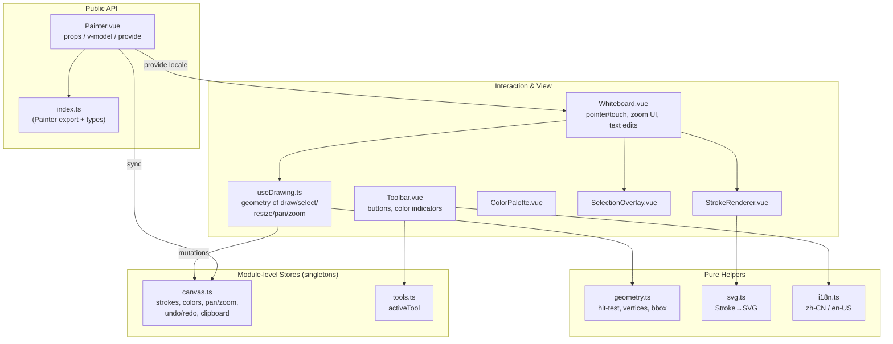

# Xiaodao Painter Architecture Design Document

This document explains how **xiaodao-painter** is structured internally: the module layout, the state model, the data-flow between the public API and the canvas, the rendering pipeline, the interaction engine, and the undo/redo design. It is meant to be read alongside the source under `src/components/painter/`.

## 1. Design Goals

- **Self-contained.** A single Vue 3 component, no runtime dependencies beyond Vue, no global registration, no CSS framework.
- **Serializable state.** The whole drawing is one plain object (`PainterData`), so it can be saved, loaded, and synced trivially.
- **Predictable two-way binding.** The parent owns the data; the component reflects it and emits changes back through `v-model`.
- **Framework-light interaction.** Pointer + touch handled manually for cross-browser correctness (notably iOS Safari `getScreenCTM` issues under CSS transforms).

## 2. High-Level Architecture



The architecture is three conceptual layers:

1. **Public API**: `index.ts` + `Painter.vue`. The only thing consumers import.
2. **Stores**: two module-level reactive singletons (`canvas.ts`, `tools.ts`). They hold all mutable state and the mutation API. Because they are module-scoped, every `useCanvasStore()` call returns the same object.
3. **View / Engine**: Vue components and the `useDrawing` composable that translate raw pointer events into store mutations, plus pure helper modules (`geometry`, `svg`, `i18n`).

## 3. State Management

State lives in two module-level reactive objects created with `reactive()`:

| Store | Responsibility |
| --- | --- |
| `canvas.ts` | `strokes[]`, `selectedStrokeIds`, foreground/background/text colors, color slot, stroke width, canvas size, pan/zoom, undo/redo stacks, clipboard, text-edit state, theme, `dataVersion`. |
| `tools.ts` | `activeTool` and `setTool()` (which clears selection when leaving "select"). |

`canvas.ts` exposes a single `state` object and `useCanvasStore()` returns it directly:

```ts
export function useCanvasStore(): CanvasStore {
  return state
}
```

**Implication / limitation:** Because the store is a singleton, the current code assumes a single active instance per page. `Painter.vue` calls `canvasStore.reset()` and `toolsStore.reset()` on setup to guarantee a clean slate. Rendering two `<Painter>` instances on one page would share state: a known constraint to address before multi-instance support is needed.

### v-model Protocol

`Painter.vue` bridges the parent's `modelValue` and the internal store:

- **Parent → store:** a deep watcher on `modelValue.strokes` calls `canvasStore.syncFromParent()`, guarded by a `syncing` flag to avoid feedback loops. Canvas size and background are pushed on change.
- **Store → parent:** a watcher on `strokes.length | canvasWidth | canvasHeight | canvasBackgroundColor | dataVersion` triggers `emit('update:modelValue', …)` with a cloned snapshot. A `suppressing` flag prevents the emitted value from re-entering `syncFromParent`.

This dual-flag design (`syncing` in the store, `suppressing` in the component) is what keeps the two-way binding stable without infinite watches.

## 4. Coordinate System & Transform

The canvas is an SVG with a fixed `viewBox` (`0 0 canvasWidth canvasHeight`). Pan and zoom are applied as a single CSS transform on the wrapper:

```
transform: translate(panX, panY) scale(zoomLevel)
```

Screen → canvas conversion is done manually (not via `getScreenCTM`):

```ts
canvasX = (clientX - wrapperRect.left) / zoomLevel
canvasY = (clientY - wrapperRect.top) / zoomLevel
```

This is deliberate: `getScreenCTM()` is unreliable on iOS Safari when ancestor elements use CSS transforms with `will-change`, so the manual calculation gives consistent behavior across browsers.

## 5. Rendering Pipeline

Each `Stroke` is rendered by `StrokeRenderer.vue`, which calls `strokeToSvg(stroke)` from `utils/svg.ts`:

| `type` | SVG element | Notes |
| --- | --- | --- |
| `pencil` | `<path>` | Quadratic Bézier smoothing from `points`; `fill:none`. |
| `line` | `<line>` | From `(x,y)` to `(x+width, y+height)`. |
| `circle` | `<ellipse>` | Centered in the bounding box. |
| `rect` | `<rect>` | Normalized to positive width/height. |
| `triangle` | `<polygon>` | Vertices from `triangleVertices()`. |
| `star` | `<polygon>` | 5-point star from `starVertices()` with inner ratio 0.382. |
| `text` | `foreignObject` | Rendered as an editable `<div>` in `Whiteboard.vue` instead. |

Text strokes are handled specially: in `Whiteboard.vue` they are emitted as `<foreignObject>` wrapping a `contenteditable` `<div>`, so users can type directly. `SelectionOverlay.vue` draws the dashed bounding box and resize handles (8 for shapes, 2 endpoints for lines).

## 6. Interaction Engine (`useDrawing.ts`)

`useDrawing(wrapperRef)` encapsulates all pointer/touch logic and returns handlers wired into `Whiteboard.vue`:

- **Pointer down/move/up** unify mouse and touch paths.
- **Drawing tools** build a live `previewStroke` (computed) while dragging, then commit on up via `canvasStore.buildStroke()` + `addStroke()`.
- **Select tool** distinguishes click-select vs box-select vs move based on hit-test and drag distance (`dist < 3` → select single / clear).
- **Resize** computes new bounds from the active handle, with Shift = center-out and modifier-aware diagonal locking for closed shapes.
- **Pan** and **Zoom** mutate `panX/panY` / `zoomLevel`; zoom snaps to a fixed `ZOOM_STEPS` ladder and is anchored at the cursor.
- **Text** defers creation to pointer-up; editing is committed on Enter or blur (`commitTextEdit`/`cancelTextEdit`).

Hit-testing lives in `geometry.ts` (`hitTestStroke`) using point-to-segment distance for strokes/lines and point-in-shape tests for filled primitives.

## 7. Undo / Redo

Undo/redo is **snapshot-based**. `pushUndo()` clones the entire `strokes` array (deep copy of `points`) onto `undoStack` and clears `redoStack`. Mutation operations (`addStroke`, `updateStroke`, `delete…`, `move…`, `paste…`) call `pushUndo()` *before* applying the change. `undo()`/`redo()` swap the working array with the stacks. `dataVersion` is bumped after structural edits so the `v-model` watcher emits an update.

Text creation is special: an empty text stroke pushes an undo entry on creation; if the user cancels or leaves it empty, that entry is popped so no empty history is recorded.

## 8. Theming & i18n

- **Theme** is propagated through `useI18n.provideTheme` / `provideLocale` (provide/inject) and realized with CSS custom properties in `style.css` (`.wb-theme-light` / `.wb-theme-dark`). Components consume `--wb-*` variables, so light/dark is a single class swap.
- **i18n** is a small dictionary lookup (`t(locale, key)`) with `zh-CN` and `en-US` tables in `utils/i18n.ts`. Toolbar labels, popovers, and zoom indicator all route through `t()`.

## 9. Build & Outputs

- `npm run build` builds the library (ESM + UMD + CSS + types) via `vite.config.ts` (lib mode).
- `npm run build:demo` builds the demo page (`index.html` + `App.vue`) via `vite.demo.config.ts` into `dist-demo/`, exported as a static site.
- `dist-demo` and `dist` are both git-ignored and treated identically.

## 10. Known Limitations & Next Steps

- **Single-instance assumption.** The module-level store is a singleton; multiple `<Painter>` components on one page share state. To support multiple instances, promote the store to a `provide`/`inject` scoped store per component.
- **Stroke model granularity.** Undo snapshots the whole `strokes` array; very large drawings could be optimized with per-stroke patches.
- **No persistence layer.** `PainterData` is serializable; a save/load export feature (PNG/SVG/JSON) would be a natural extension (consider an automation or plugin if recurring).
