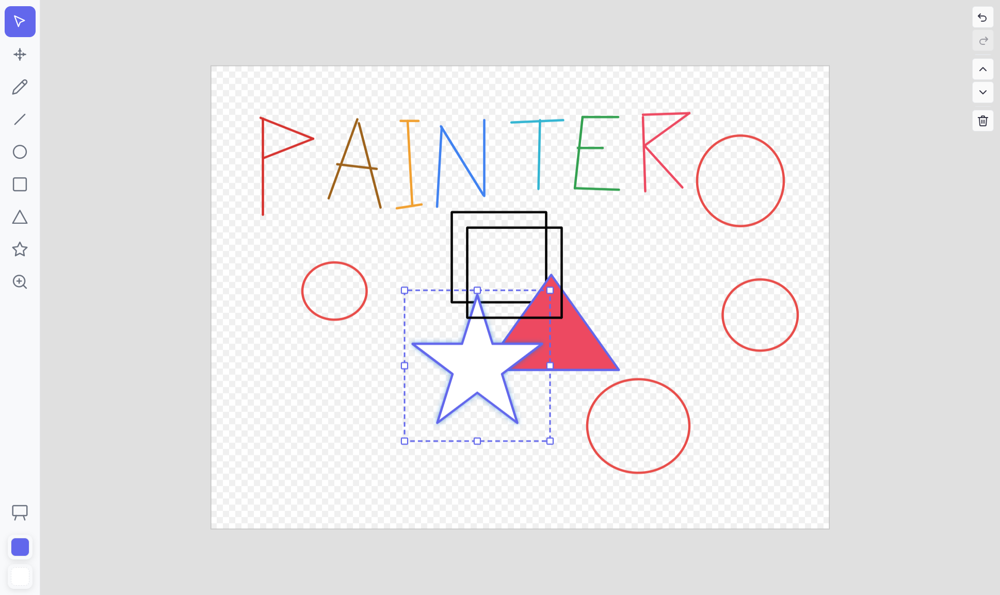

# xiaodao-painter

A self-contained, embeddable SVG whiteboard component for Vue 3. Built with TypeScript, Pinia, and Vite.

Supports drawing tools, selection, resize, pan/zoom, undo/redo, clipboard, layer ordering, color palettes, i18n, and light/dark themes — all with two-way data binding via `v-model`.



## Features

- **9 tools** — Select, Pan, Zoom, Pencil, Line, Circle, Rectangle, Triangle, Star
- **Selection & manipulation** — click to select, box-select, drag-move, 8-handle resize (Shift = symmetric), layer reorder (bring to front / send to back)
- **Pan & zoom** — grab-drag panning, discrete zoom steps (10% – 1000%) anchored at cursor position
- **Undo / redo** — full stroke-level undo/redo stacks
- **Internal clipboard** — cut, copy, paste (within the whiteboard, offset +20 px)
- **Color system** — stroke (foreground) and fill (background) color slots, per-stroke color application to selections, canvas background color with transparent grid support
- **Themes** — light and dark, with auto-switching foreground color on theme change
- **Internationalization** — Chinese (zh-CN) and English (en-US) built in
- **Keyboard shortcuts** — Delete, Escape, Ctrl+Z / Ctrl+Y / Ctrl+X / Ctrl+C / Ctrl+V
- **Modifier keys** — Ctrl = constrain 1:1 ratio, Shift = center-out expansion / 45° line snap
- **Two-way binding** — parent reads/writes full drawing data via `v-model`

## Installation

```bash
npm install
```

## Usage

```vue
<script setup lang="ts">
import { ref, watch } from 'vue'
import PainterApp from './components/painter/Home.vue'
import type { PainterData } from './components/painter/types'

const data = ref<PainterData>({
  strokes: [],
  canvasWidth: 800,
  canvasHeight: 600,
})

watch(data, (val) => {
  console.log('Drawing data changed:', val)
}, { deep: true })
</script>

<template>
  <PainterApp
    v-model="data"
    theme="light"
    locale="zh-CN"
  />
</template>
```

With explicit dimensions:

```html
<PainterApp
  v-model="data"
  theme="dark"
  locale="en-US"
  width="1200"
  height="800"
/>
```

## Props

| Prop | Type | Default | Description |
| --- | --- | --- | --- |
| `modelValue` | `PainterData` | `{ strokes: [], canvasWidth: 800, canvasHeight: 600 }` | Two-way bound drawing data |
| `theme` | `'light' \| 'dark'` | `'light'` | UI theme |
| `locale` | `string` | `'zh-CN'` | UI language (`'zh-CN'` or `'en-US'`) |
| `width` | `string \| number` | `'100%'` | Component width (CSS value or px number) |
| `height` | `string \| number` | `'100%'` | Component height (CSS value or px number) |

## Data Model

```ts
interface PainterData {
  strokes: Stroke[]
  canvasWidth: number
  canvasHeight: number
}

interface Stroke {
  id: string
  type: 'select' | 'pencil' | 'line' | 'circle' | 'rect' | 'triangle' | 'star'
  x: number
  y: number
  width: number
  height: number
  points: Point[]
  strokeColor: string
  fillColor: string
  strokeWidth: number
}
```

## Keyboard Shortcuts

| Key | Action |
| --- | --- |
| `Delete` / `Backspace` | Delete selected strokes |
| `Escape` | Clear selection |
| `Ctrl + Z` | Undo |
| `Ctrl + Y` / `Ctrl + Shift + Z` | Redo |
| `Ctrl + X` | Cut |
| `Ctrl + C` | Copy |
| `Ctrl + V` | Paste (offset +20 px) |

## Project Structure

```
src/
  components/painter/
    Painter.vue            # Public entry (props, v-model, theme sync)
    Whiteboard.vue         # SVG canvas, keyboard shortcuts, pan/zoom centering
    Toolbar.vue            # Left toolbar (tools, canvas settings, color indicators)
    ColorPalette.vue       # Color picker popover
    SelectionOverlay.vue   # Selection bounding box + resize handles
    StrokeRenderer.vue     # Renders a single stroke as SVG
    composables/
      useDrawing.ts        # Mouse interaction engine (draw, select, move, resize)
      useI18n.ts           # Locale and theme provide/inject
    stores/
      canvas.ts            # Main store (strokes, colors, pan/zoom, undo, clipboard)
      tools.ts             # Active tool state
    utils/
      geometry.ts          # Hit testing, star/triangle vertices, bounding box
      svg.ts               # Stroke-to-SVG element conversion
      i18n.ts              # zh-CN / en-US dictionaries
    types/
      index.ts             # TypeScript types and default constants
    style.css              # CSS custom properties (themes)
```

## Development

```bash
npm run dev     # Start dev server
npm run build   # Type-check and build for production
npm run preview # Preview production build
```

## License

MIT